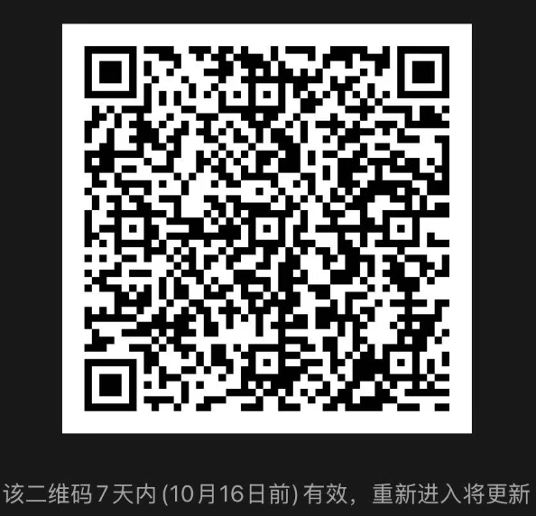

# joylive-injector

[](https://github.com/jd-opensource/joylive-injector)
[](https://github.com/jd-opensource/joylive-injector/releases)
[](https://joylivehq.slack.com)



English | [简体中文](./README-zh.md)

## Description
This is a dynamic admission control webhook for kubernetes, it can be used to mutate kubernetes resources.
This program monitors the `CREATE`, `UPDATE`, `DELETE` events for `deployments` and the `CREATE` events for `pods` and adds the initContainer for `Pod` , adds the environment variable `JAVA_TOOL_OPTIONS` by default, mounts the configmap, modifies the volume load for the main container, and so on.

## Features
- Supports automatically injecting `joylive-agent` into Pods of Java applications.
- Supports multi-version `joylive-agent` and corresponding configuration management.
- Support injection of specified version `joylive-agent` and corresponding configuration.

## Used
### Full mode
- Install CFSSL (HTTP API tool for signing, verifying, and bundling TLS certificates) in the environment to be deployed
    ```bash
    wget https://pkg.cfssl.org/R1.2/cfssl-certinfo_linux-amd64
    wget https://pkg.cfssl.org/R1.2/cfssl_linux-amd64
    wget https://pkg.cfssl.org/R1.2/cfssljson_linux-amd64 
    mv cfssl-certinfo_linux-amd64 /usr/local/bin/cfssl-certinfo 
    mv cfssl_linux-amd64 /usr/local/bin/cfssl
    mv cfssljson_linux-amd64 /usr/local/bin/cfssljson
    chmod +x /usr/local/bin/cfssl-certinfo /usr/local/bin/cfssl /usr/local/bin/cfssljson
    ```
- Copy `cfssl` and `joylive webhook` from the deploy directory to the environment to be deployed
- The namespace in `cfssl/dac-csr.json` is currently filled in as `joylive` and needs to be modified according to the actual situation
- Execute the `create-secret.sh` script in the `joylive-injector/deploy/cfssl` directory to generate a secret. If the `joylive-injector` package is in the same directory as `cfssl`, it can automatically replace the value of the `caBundle`, `caKeyBundle` and `caPubBundle` field
- If the value of `caBundle`, `caKeyBundle` and `caPubBundle` are not replaced, it is necessary to manually replace the value of the `caBundle`, `caKeyBundle` and `caPubBundle` field in the `value.yaml` in the chart package. Use the content generated by `cat dac-ca.pem | base64 | tr -d '\n'` as `caBundle`, `cat dac-key.pem | base64 | tr -d '\n'` as `caKeyBundle`, `cat dac.pem | base64 | tr -d '\n'` as `caPubBundle` to replace them
- Execute `helm install joylive-injector ./joylive-injector -n joylive` Install webhook
- Modify the configuration in the `value.yaml` section of the chart package as needed

### Simple mode
Since the certificate signature has been pre-generated according to the namespace `joylive`, it is necessary to specify installation to the corresponding namespace. Execute the command:
```bash
helm install joylive-injector ./packages/joylive-injector-1.1.0.tgz -n joylive
```
